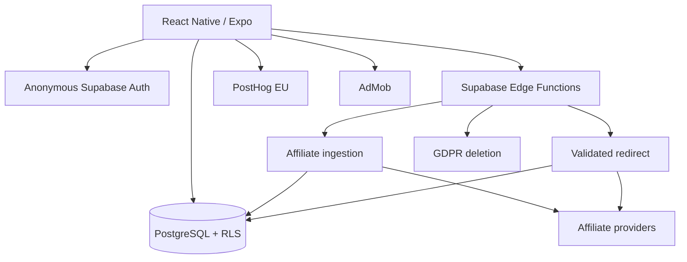

<p align="center">
  
</p>

<p align="center">
  
  
  
  
  
</p>

# DealFeed — mobile product engineering showcase

A TikTok-style vertical feed for shopping deals: swipe, save, open the merchant, keep the product experience fast and keep analytics/consent explicit.

The implementation repository is private. This showcase documents the architecture and core engineering decisions.

## Architecture



## Product / engineering decisions

- React Native + Expo for a single iOS/Android codebase.
- TypeScript throughout the app.
- Zustand for lightweight persisted client state.
- FlashList for media-heavy vertical feed rendering.
- Supabase anonymous auth to minimise signup friction.
- PostgreSQL RLS to keep user-owned state isolated.
- Edge Functions for ingestion, redirect tracking and deletion flows.
- Server-side affiliate redirect allow-listing.
- Daily product ingestion with quality filters + deduplication.
- Explicit analytics and advertising consent.
- GDPR data deletion across application state and analytics identity.

## Data flow

```text
affiliate source
      ↓
scheduled ingestion
      ↓
quality filter + dedupe
      ↓
PostgreSQL
      ↓
mobile feed
      ↓
validated /go redirect
      ↓
merchant
```

## Privacy by design

The project treats consent and deletion as system behaviour rather than a settings-page afterthought.

- Analytics can remain disabled until consent.
- Advertising consent is tracked separately.
- Saved user data is scoped by RLS.
- Deletion removes owned state and de-identifies retained aggregate events.

## Repository map

- [Architecture](docs/ARCHITECTURE.md)
- [Privacy model](docs/PRIVACY.md)
- [Sanitised ingestion example](examples/ingest-products.ts)

## Source availability

Full app source, provider configuration and store credentials remain private.
