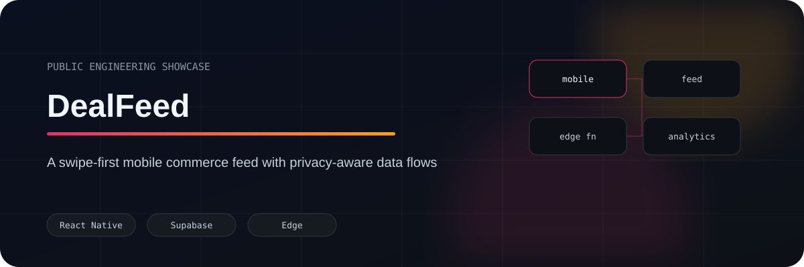
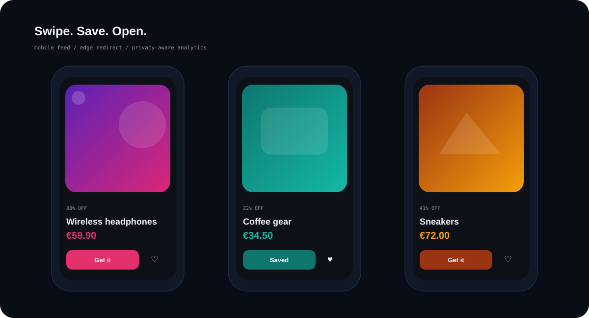
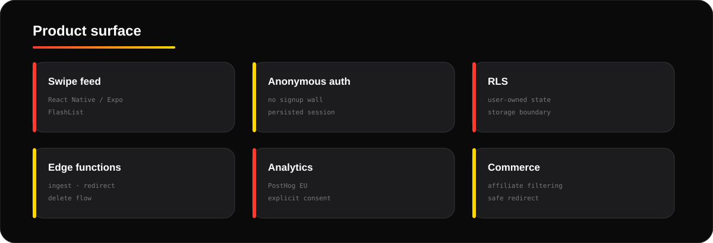
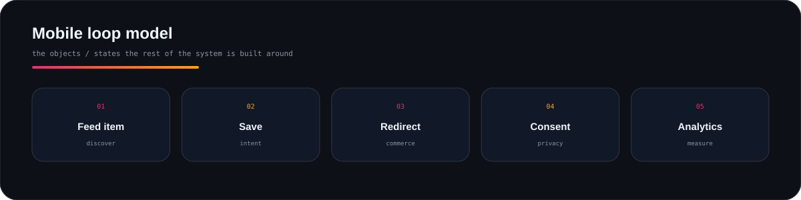
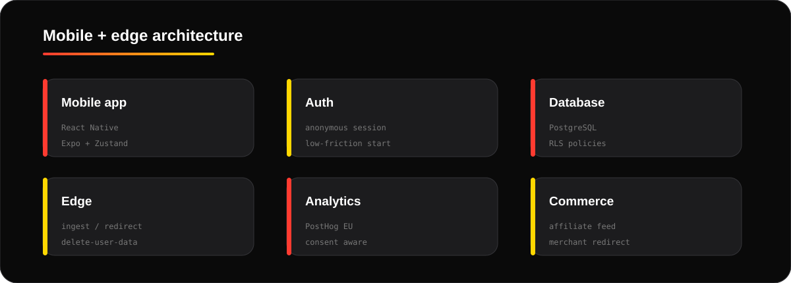
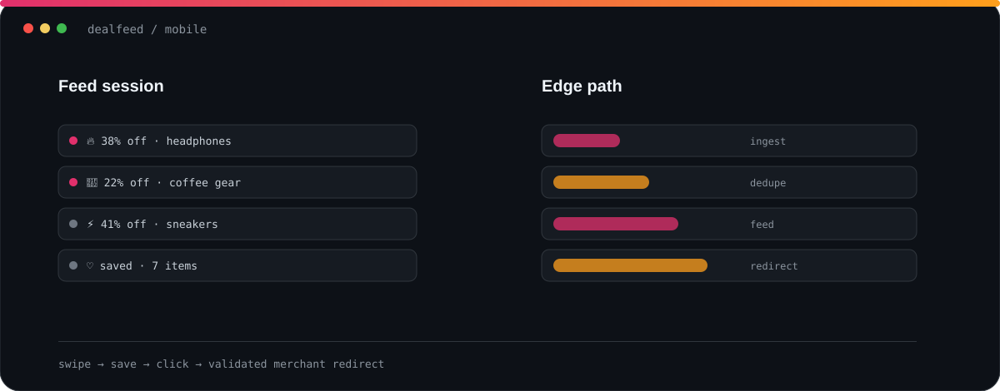
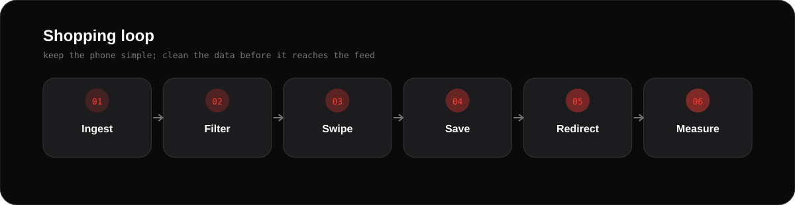
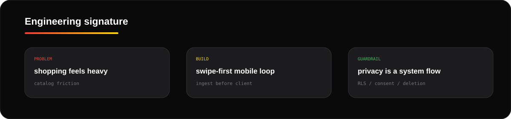

  
  
  
  
  

# DealFeed

A mobile product I built around a deliberately simple loop: **swipe deals, save what matters, open the merchant**.

No catalogue ceremony.

## <code>01 / product_surface</code>

## <code>02 / core_model</code>

## <code>03 / architecture</code>

## <code>04 / shopping_loop</code>

## <code>05 / decisions</code>

| Decision | Why |
|---|---|
| React Native + Expo | one mobile codebase, fast iteration |
| Zustand | enough state without framework ceremony |
| anonymous auth | value before signup |
| PostgreSQL RLS | user-owned isolation near storage |
| edge redirect | auditable click trail |
| explicit consent | analytics and ads are separate decisions |

**Keep the phone stupid:** clean, filter and dedupe the feed before it reaches the client.

## <code>06 / engineering_signature</code>

  

## <code>07 / inspect</code>

- [Architecture](docs/ARCHITECTURE.md)
- [Privacy model](docs/PRIVACY.md)
- [Sanitised ingestion logic](examples/ingest-products.ts)

<b>Private source boundary</b>

Provider configuration, store credentials and the full mobile implementation remain private.

