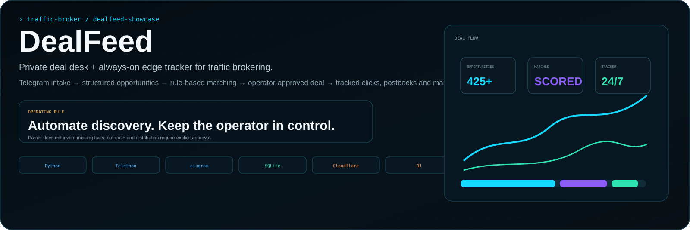
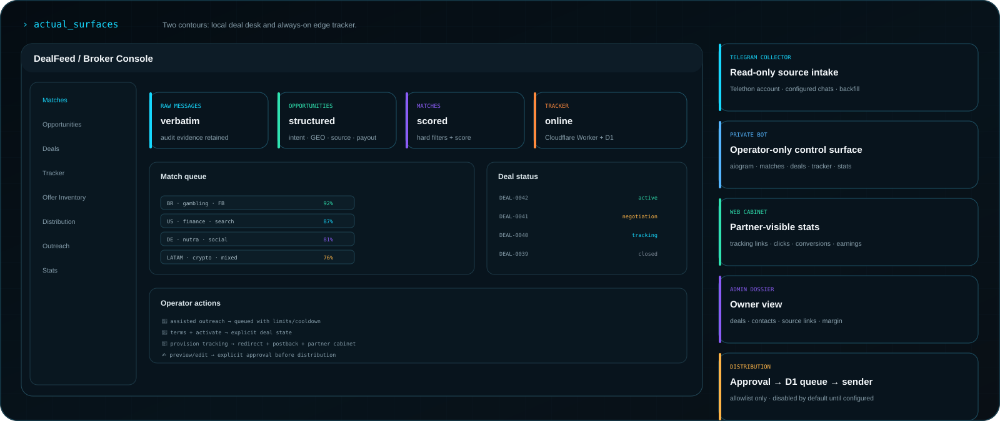
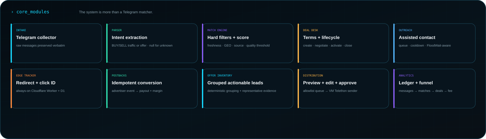
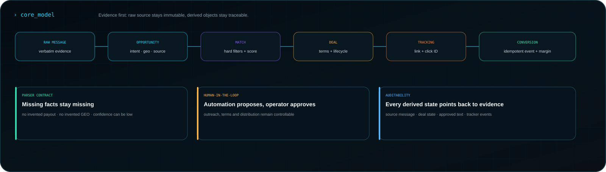
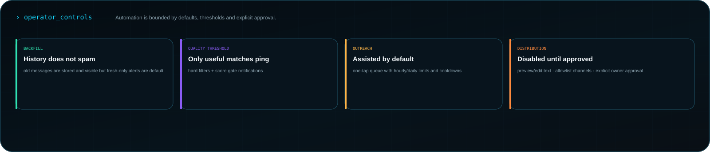
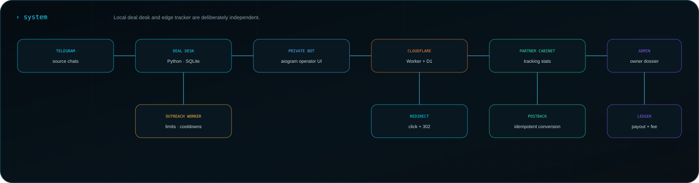
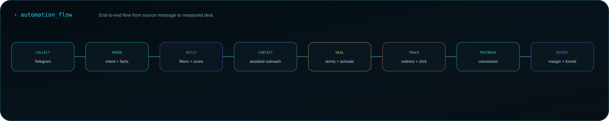
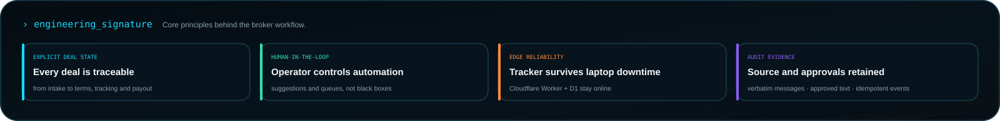

  
  
  
  
  

# DealFeed

A private **deal desk + traffic tracker** built for an operator brokering traffic between advertisers and publishers.

The product is split into two independent contours:

- **Deal desk** — local Python/SQLite pipeline for Telegram collection, parsing, matching, operator outreach and deal management.
- **Edge tracker** — always-on Cloudflare Worker + D1 for redirects, clicks, postbacks, conversions, partner stats and margin accounting.

> **Automate discovery. Keep the operator in control.**

## <code>01 / actual_surfaces</code>

The private bot is the main operator interface. It surfaces fresh high-quality matches, creates deals, stores terms, provisions tracking links and exposes tracker statistics without turning the workflow into a fully automatic black box.

## <code>02 / core_modules</code>

The original showcase described a consumer deal app; that was the wrong product. The actual system covers source intake, structured opportunity parsing, matching, assisted outreach, deal lifecycle, edge tracking, postbacks, grouped offer inventory, controlled distribution and broker analytics.

## <code>03 / core_model</code>

Raw Telegram messages are kept verbatim as audit evidence. Derived opportunities and matches point back to that source. The parser does not fabricate absent values: missing GEO, payout or other fields remain missing with appropriately low confidence.

## <code>04 / operator_controls</code>

Backfill is stored without notification spam. Match notifications use quality thresholds. Outreach is assisted by default with limits/cooldowns. Distribution requires preview/edit and explicit approval to allowlisted channels.

## <code>05 / system</code>

The edge tracker stays online independently of the local deal desk. That separation keeps click/postback accounting available even when the collector/operator machine is offline.

## <code>06 / automation_flow</code>

## <code>07 / engineering_signature</code>

## <code>08 / inspect</code>

- [Architecture](docs/ARCHITECTURE.md)
- [Operational safety](docs/OPERATIONS.md)
- [Sanitised matching example](examples/match-engine.py)

<b>Public / private boundary</b>

Source chats, accounts, credentials, tracking secrets, commercial terms, private contacts and production provider configuration remain private. The showcase publishes the architecture and engineering model, not operational access.

