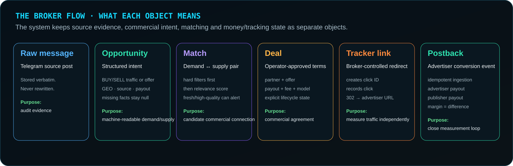
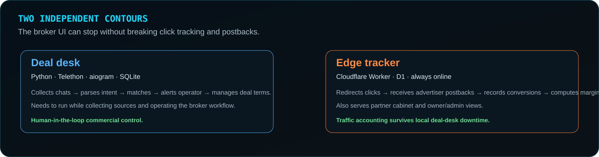

> **A private traffic-broker deal desk plus an always-on tracking edge.**  
> Telegram source posts become structured opportunities, candidate matches, operator-approved deals and measurable click/conversion flows.

<table>
<tr>
<td align="center"><b>Telethon</b> read-only source intake</td>
<td align="center"><b>aiogram</b> private operator bot</td>
<td align="center"><b>SQLite</b> deal-desk state</td>
<td align="center"><b>Cloudflare Worker</b> edge tracker</td>
<td align="center"><b>D1</b> tracking / inventory state</td>
<td align="center"><b>Human-in-the-loop</b> commercial control</td>
</tr>
</table>

## What the system actually does

<table>
<tr>
<td width="33%" valign="top"><b>Collect</b> Read configured Telegram chats through a collector account and store source messages verbatim.</td>
<td width="33%" valign="top"><b>Understand</b> Extract BUY/SELL traffic or offer intent, GEO, traffic source and payout when the message actually contains them.</td>
<td width="33%" valign="top"><b>Match</b> Apply hard filters first, then a relevance score. Only fresh/high-quality candidates should alert the operator.</td>
</tr>
<tr>
<td valign="top"><b>Operate</b> The private bot lets the operator review matches, contact sides, set terms, activate/close deals and provision tracking.</td>
<td valign="top"><b>Track</b> Broker-controlled links record clicks and redirect traffic to the advertiser with a click ID.</td>
<td valign="top"><b>Measure</b> Advertiser postbacks become idempotent conversions; the tracker can calculate advertiser payout, publisher payout and broker margin.</td>
</tr>
</table>

## Core objects

> **Parser rule:** if the source message does not provide GEO, payout, traffic source or another field, the parser leaves it missing instead of inventing a value.

## Why there are two systems

<table>
<tr>
<td width="50%" valign="top"><b>Deal desk = decision workflow.</b> It can be offline when the operator is not collecting sources or reviewing matches.</td>
<td width="50%" valign="top"><b>Edge tracker = accounting path.</b> It stays online independently so redirect, click, postback and partner-stat flows do not depend on the operator machine.</td>
</tr>
</table>

## Operator controls

<table>
<tr>
<td width="33%" valign="top"><b>Backfill stays quiet</b> Historical messages can be stored and searched without generating a storm of “fresh match” notifications.</td>
<td width="33%" valign="top"><b>Outreach is assisted</b> Messages can be prepared/queued with rate limits, cooldowns and FloodWait handling instead of uncontrolled auto-spam.</td>
<td width="33%" valign="top"><b>Distribution requires approval</b> Offer-inventory text is previewed/edited and explicitly approved before allowlisted distribution jobs are sent.</td>
</tr>
</table>

## Offer inventory / distribution

- Advertiser-side signals are also stored as raw offer-inventory evidence.
- Repeated commercial signals can be grouped into one actionable owner card.
- The representative source and raw-post count remain visible.
- Advertiser payout stays private.
- Public outbound text is stored exactly as approved.
- Distribution is disabled by default until capability/allowlist checks pass.

## Architecture

## End-to-end flow

<b>Operational notes</b>

- Deal desk: Python + SQLite, one event loop, Telethon collector + aiogram operator bot.
- Edge tracker: Cloudflare Worker + D1, independent from the local deal desk.
- Partner cabinet shows partner-owned links/clicks/conversions/earnings.
- Owner/admin view exposes deal, contact, payout and margin context.
- Postbacks are idempotent.
- Source evidence and approved outbound text are retained for traceability.

