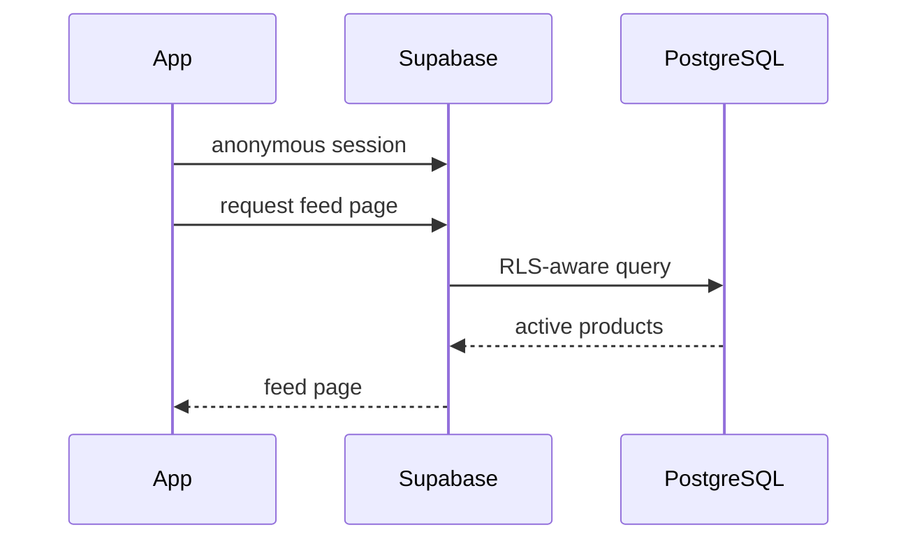

# Architecture

## Main flows

### Feed



### Product ingestion

```text
scheduled trigger
  -> fetch provider feed
  -> normalise
  -> quality filter
  -> dedupe
  -> batch upsert
  -> structured result
```

### Click-out

The client opens a server-controlled redirect endpoint. The edge function validates the product, verifies the target domain against an allow-list, records the click event and returns a redirect.

This preserves an auditable server-side click trail even if client analytics fails.
